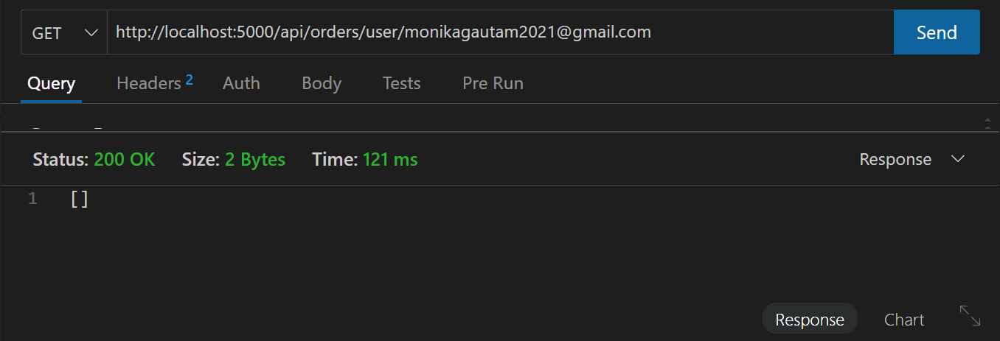
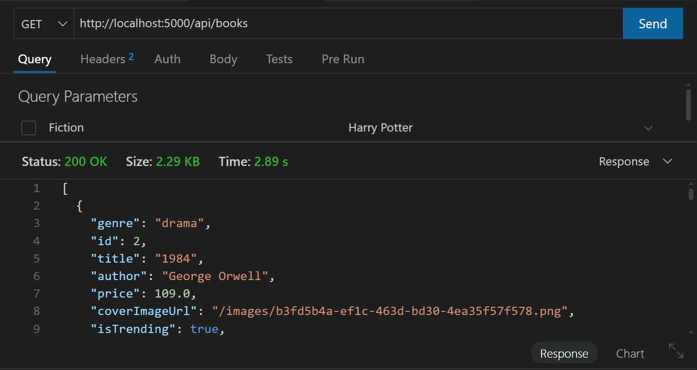
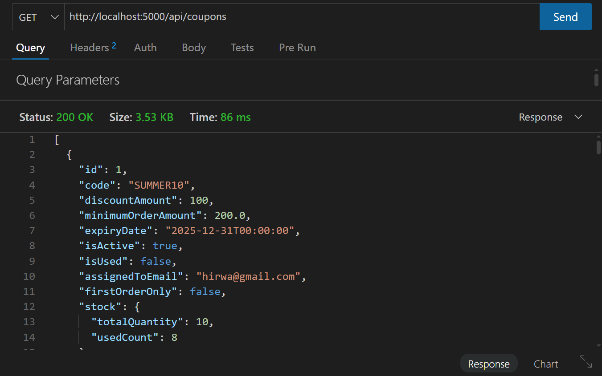
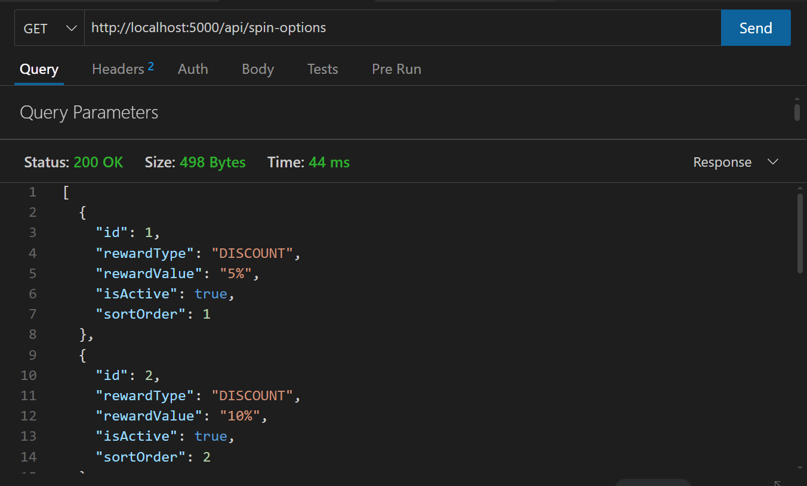

**IT 643 SOFTWARE DESIGN AND TESTING**

**CHAPTER 4 \- TESTING**

GROUP MEMBERS:  
MANYA SINGH \- 202412047  
MONIKA GAUTAM \- 202412049  
DHARA PATEL \- 202412065  
HIRWA SARAIYA \- 202412088

# **TEST STRATEGY DOCUMENT**

Project Name: Chapter 4 – Online Bookstore  
Version: 1.0  
Date: *30/11/25*

## **1\. Introduction**

The purpose of the Test Strategy document is to define the overall testing approach for the Chapter 4 Bookstore application. This e-commerce platform, built with React (Frontend) and .NET Web API (Backend), enables users to browse books, authenticate, add items to cart, wishlist, and complete purchases through secure payment integration.

This document outlines testing types, scope, tools, environments, responsibilities, and defect workflow.

## **2\. Objectives**

* Ensure the Bookstore application functions as expected across all modules.  
* Validate performance, usability, security, and reliability.  
* Detect defects early and ensure high product quality.  
* Ensure integrations (authentication, database) work correctly.

## **3\. Scope of Testing**

### In Scope

* Functional Testing  
* Integration Testing  
* Security Testing (basic)  
* Performance Testing (API response validation)  
* Usability Testing  
* Cross-browser Testing  
* Validation of 3rd party integrations (Razorpay, JWT Auth)

### Out of Scope

* Load/Stress testing  
* Deep penetration testing (requires security team)  
* Non-book modules not implemented  
* Backend database backup/restore testing

## **4\. Test Approach**

### **4.1 Functional Testing**

Performed manually based on test cases. Includes:

* Login & Authentication  
* Search & Filtering  
* Book Catalog  
* Cart & Wishlist  
* Reviews and Ratings  
* Checkout & Payments  
* User Profile

### **4.2 Integration Testing**

* API integration with frontend  
* Database interactions (EF Core)

### **4.3 Regression Testing**

Executed after every major change.

### **4.4 System Testing**

Complete end-to-end testing of the entire workflow.

### **4.5 User Acceptance Testing (UAT)**

Final validation by stakeholders.

## **5\. Test Environment**

### Frontend Environment

* React 18  
* Chrome, Firefox, Edge, Safari

### Backend Environment

* .NET 9  
* SQLite  
* Thunder Client for API validation  
* JWT authentication enabled

### Tools

* Thunder Client (API testing)  
* GitHub (Version control)  
* VS Code   
* Browser DevTools

## **6\. Entry & Exit Criteria**

### Entry Criteria

* Requirements finalized  
* Build deployed to testing environment  
* Test data prepared  
* Necessary tools available

### Exit Criteria

* All planned test cases executed  
* Major defects fixed and verified  
* No blocker or critical defects open

## **7\. Test Deliverables**

* Test Strategy  
* Test Cases  
* Test Summary Report

### **FUNCTIONAL TEST CASES**

### **MODULE 1: User Authentication**

* Signup  
* Login  
* Logout  
* Password validation  
* Profile management

| Test Case ID | Scenario | Steps | Expected Result | Actual Result | Pass/Fail |
| :---- | :---- | :---- | :---- | :---- | :---- |
| AUTH\_01 | Sign-up with valid details | 1\. Open Sign-up page 2\. Enter valid name, email, password 3\. Click "Register" | User account created and redirected to login | User account created and redirected to login | Pass |
| AUTH\_02 | Sign-up with existing email | Enter an already registered email | System shows “Email already exists” error | System shows “Email already exists” error | Pass |
| AUTH\_03 | Sign-up with weak password | Enter password less than required strength | Password error message appears | Password error message appears | Pass |
| AUTH\_04 | Login with valid credentials  | Enter registered email \+ password | User logs in successfully and redirected to home | User logs in successfully and redirected to home | Pass |
| AUTH\_05 | Login with wrong password | Enter wrong password | System shows “Invalid credentials” | System shows “Invalid credentials” | Pass |
| AUTH\_06 | Login with unregistered email | Use email not in system | System shows “Account does not exist” | System shows “Account does not exist” | Pass |
| AUTH\_07 | Logout | Click Logout button | User session ends and redirected to login page | User session ends and redirected to login page | Pass |
| AUTH\_08 | Access profile page after logout | Logout → Attempt to open /profile | User is redirected to login | User is redirected to login | Pass |
| AUTH\_09 | Profile update | Change profile fields → save | Profile saves successfully | Profile saves successfully | Pass |

### **MODULE 2: Catalog & Browsing**

* View all books  
* View book details  
* Categories listing  
* Real-time availability

| Test Case ID | Scenario | Steps | Expected Result | Actual Result | Pass/Fail |
| :---- | :---- | :---- | :---- | :---- | :---- |
| CAT\_01 | View all books | Navigate to “All Books” | User account created and redirected to login | List of books is displayed | Pass |
| CAT\_02 | View books by category | Select “Indian” category | Only books in that category appear | Only books in that category appear | Pass |
| CAT\_03 | Book availability shown | Open book card | “In Stock” or “Out of Stock” visible | “In Stock” or “Out of Stock” visible | Pass |
| CAT\_04 | Click on book to view details  | Click book title or card | Book details page opens | Book details page opens | Pass |

### **MODULE 3: Searching & Filtering**

* Search by title  
* Search by author  
* Search by image  
* Search with no results

| Test Case ID | Scenario | Steps | Expected Result | Actual Result | Pass/Fail |
| :---- | :---- | :---- | :---- | :---- | :---- |
| SRCH\_01 | Search by title | Type valid title in search bar | Matching books appear | Matching books appear | Pass |
| SRCH\_02 | Search by author | Type author name | Books by that author appear | Books by that author appear | Pass |
| SRCH\_03 | Search by image | Select image | Books by that image appear | Books by that image appear | Pass |
| SRCH\_04 | Search with no results  | Enter random text | “No books found” message shows | No message appears | Fail |
| SRCH\_05 | Apply category filter | Choose “Fiction” | Only fiction books displayed | Only fiction books displayed | Pass |
| SRCH\_06 | Apply price filter | Set price range | Books within range are shown | Books within range are shown | Pass |
| SRCH\_07 | Multiple filters together | Category \+ Price \+ Rating | Results match all filters | Results match all filters | Pass |

**MODULE 4: Book Details**

* Books Details  
* Similar/recommended books  
* Out-of-stock books

| Test Case ID | Scenario | Steps | Expected Result | Actual Result | Pass/Fail |
| :---- | :---- | :---- | :---- | :---- | :---- |
| DET\_01 | Book details page loads | Open any book | Book title, author, price, description displayed | Book title, author, price, description displayed | Pass |
| DET\_02 | Show similar/recommended books | Scroll to suggestions | Related books section appears | Related books section appears | Pass |
| DET\_03 | Out-of-stock book cannot be purchased | Open out-of-stock item | "Add to Cart" disabled | "Add to Cart" disabled | Pass |

### **MODULE 5: Wishlist**

* Add to wishlist  
* Remove from wishlist  
* View wishlist

| Test Case ID | Scenario | Steps | Expected Result | Actual Result | Pass/Fail |
| :---- | :---- | :---- | :---- | :---- | :---- |
| WISH\_01 | Add item to wishlist | Click “Add to Wishlist” | Item added; wishlist icon changes | Item added; wishlist icon changes | Pass |
| WISH\_02 | Remove item from wishlist | In wishlist → remove item | Item removed | Item removed | Pass |
| WISH\_03 | Wishlist persists after refresh | Add → Reload page | Items remain saved | "Add to Cart" disabled | Pass |
| WISH\_04 | Add an already wishlisted item | Click wishlist again | Item removed | Item removed | Pass |

### **MODULE 6: Cart**

* Add to cart  
* Change quantity  
* Remove item  
* Cart total calculation

| Test Case ID | Scenario | Steps | Expected Result | Actual Result | Pass/Fail |
| :---- | :---- | :---- | :---- | :---- | :---- |
| CART\_01 | Add item to cart | Click “Add to Cart” from book detail | Item appears in cart | Item appears in cart | Pass |
| CART\_02 | Increase quantity | Change qty \+ | Total updates correctly | Total updates correctly | Pass |
| CART\_03 | Decrease quantity | Reduce quantity \- | Total updates, quantity cannot go below 1 | Total updates, quantity cannot go below 1 | Pass |
| CART\_04 | Remove item from cart  | Click remove/delete | Item removed from cart | Item removed from cart | Pass |
| CART\_05 | Cart total calculation | Add multiple items | Total \= sum of item prices | Total \= sum of item prices | Pass |
| CART\_06 | Continue shopping | From cart, click continue shopping | Redirects back to catalog | Continue shopping button is not displayed | Fail |
| CART\_07 | Cart empty message | Remove all items | “Your cart is empty” shown | “Your cart is empty” shown | Pass |

### **MODULE 7: Reviews & Ratings**

* Post review  
* View others’ reviews  
* Like review  
* Dislike review  
* Add rating  
* Add review by image

| Test Case ID | Scenario | Steps | Expected Result | Actual Result | Pass/Fail |
| :---- | :---- | :---- | :---- | :---- | :---- |
| REV\_01 | Add review (logged in) | Open book → Add review | Review successfully posted | Review successfully posted | Pass |
| REV\_02 | Display reviews | Open book → scroll | Reviews load correctly | Reviews load correctly | Pass |
| REV\_03 | Like review | Click ‘like’ button | Total like updates | Total like updates | Pass |
| REV\_04 | Dislike review  | Click ‘dislike’ button | Total dislike updates | Total dislike updates | Pass |
| REV\_05 | Add rating | Select rating | Rating successfully posted | Rating successfully posted | Pass |
| REV\_06 | Add a review with an image for a book | Enter a star rating, enter review text in the comment field, click “Upload Image” and select a valid image file. Click “Submit Review”  | Review is submitted successfully and appears in the review list with the rating, text, and uploaded image displayed correctly. | Review is submitted successfully and appears in the review list with the rating, text, and uploaded image displayed correctly. | Pass |

### **MODULE 8: Checkout & Payment**

* Address page  
* Payment gateway integration  
* Order confirmation page  
* Successful/failed payment handling

| Test Case ID | Scenario | Steps | Expected Result | Actual Result | Pass/Fail |
| :---- | :---- | :---- | :---- | :---- | :---- |
| CHK\_01 | Proceed to checkout | Click “Place order” | Redirects to address page | Redirects to address page | Pass |
| CHK\_02 | Enter valid address | Fill all required fields | Address saved | Address saved | Pass |
| CHK\_03 | Enter invalid address | Leave mandatory fields empty | Validation error | Validation error | Pass |
| CHK\_04 | Choose payment option  | Select UPI or Card | Payment screen loads | Payment screen loads | Pass |
| CHK\_05 | Successful payment | Enter valid payment | Order success page appears | Order success page appears | Pass |
| CHK\_06 | Order summary | After order → summary page | Order details visible | Order details visible | Pass |
| CHK\_07 | Order stored in DB | Complete purchase | Order shown in user history | Order shown in user history | Pass |

### **MODULE 9: Responsive UI** 

* Personalized suggestions

* Recently viewed section

---

# **API TEST CASES**

**Books APIs**

| Method | Endpoint | Description |
| :---- | :---- | :---- |
| GET | /api/books | Get all books |
| POST | /api/books | Add new book (admin) |

****

**Orders APIs**

| Method | Endpoint | Description |
| :---- | :---- | :---- |
| GET | /api/orders | Place order |
| POST | /api/orders/user/{email} | User order list |

****

**Spin & win APIs**

| Method | Endpoint | Description |
| :---- | :---- | :---- |
| POST | /api/spin/spin/{email} | Perform spin |
| GET | /api/spin-options | Admin: get spin options |
| POST | /api/spin-options | Admin: add spin option |

****

**Coupons APIs**

| Method | Endpoint | Description |
| :---- | :---- | :---- |
| GET | /api/coupons | Get all coupons |

****

## **SUMMARY**

This testing document ensures that Chapter 4 meets its functional, usability, security, and performance requirements before moving to production.

